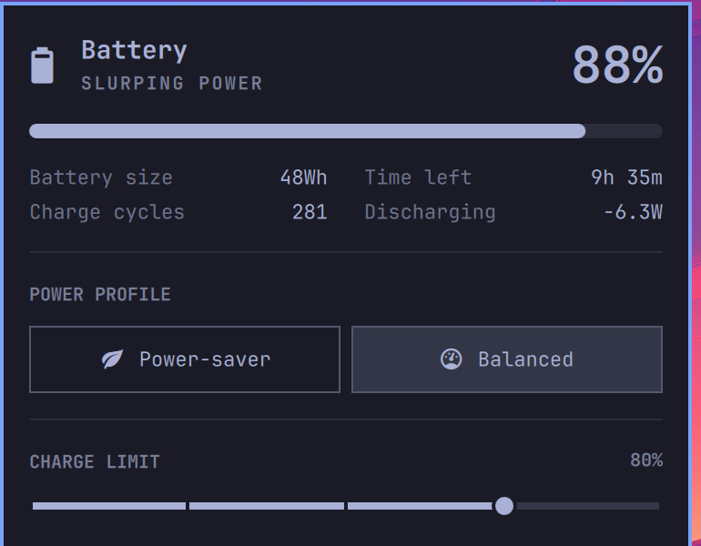

# battery-charge-limit

RO: Setează până la cât procent să se încarce bateria laptopului, ca s-o
menajezi — cu un cursor pe care-l tragi cu mouse-ul chiar în panoul de
baterie din Omarchy, plus o comandă `battery-charge-limit` din terminal.
EN: Caps how far your laptop battery is allowed to charge, to preserve its
health — with a drag slider right in Omarchy's battery panel, plus a
`battery-charge-limit` terminal command.



## Compatibility — read this first

This was built and tested on one specific setup:

- **[Omarchy](https://omarchy.org/)** (the Hyprland/Quickshell-based Arch
  distro) — the battery-panel slider needs Omarchy's shell and its
  `omarchy plugin clone` mechanism. Without Omarchy, `install.sh` still
  installs the plain `battery-charge-limit` CLI, just without the slider.
- An **Apple Silicon Mac running Asahi Linux**, whose `macsmc-battery`
  kernel driver exposes `charge_control_end_threshold` in sysfs, and whose
  `macsmc-battery-charge-control` udev/systemd units already persist the
  chosen limit across reboots.

The CLI itself only needs a battery that exposes
`/sys/class/power_supply/*/charge_control_end_threshold` (this also covers
many ThinkPads, and other laptops with an `*_laptop` charge-control kernel
driver) — but on hardware other than the Asahi Mac above, **nothing here
persists your chosen limit across a reboot**; you'd need to add that
yourself (a boot-time script, `tlp`, etc.), the same way the Asahi driver
package already does for macsmc-battery.

If you're not on Omarchy + Asahi, treat this repo as a starting point to
adapt rather than a drop-in install.

## Install

```bash
git clone https://github.com/jastincheis/battery-charge-limit.git
cd battery-charge-limit
./install.sh
```

This will:
1. Install the `battery-charge-limit` CLI to `~/.local/bin`.
2. Add a udev rule so your user (via the `wheel` group) can write the
   charge-limit sysfs files without a password prompt every time — asks
   for `sudo` once.
3. On Omarchy, clone the built-in power panel (if you haven't already —
   see [`omarchy/patch_panel.py`](omarchy/patch_panel.py)) and add a
   CHARGE LIMIT slider (20–100%, in 5% steps) to it, then restart the
   shell to load it.

## Usage

```bash
battery-charge-limit status   # show the current thresholds
battery-charge-limit 80       # stop charging at 80%
battery-charge-limit off      # (or 100) no limit — charge to full
```

Or just drag the slider in the battery panel — it only writes the new
threshold once you let go, not on every pixel of the drag.

## Uninstall

```bash
./uninstall.sh
```

Removes the CLI and udev rule. The panel slider lives in your own cloned
plugin, so it's left as-is — see the script's output for how to remove it
too if you want.

## How it works

- `bin/battery-charge-limit` writes `charge_control_start_threshold` and
  `charge_control_end_threshold` under `/sys/class/power_supply/<device>/`,
  always in an order that keeps `start <= end` valid mid-write.
- The udev rule (`install.sh` writes it to
  `/etc/udev/rules.d/90-battery-charge-control-permissions.rules`) just
  `chgrp wheel` + `chmod g+w`s those two files on device add/change, so no
  polkit agent or setuid helper is needed.
- The panel slider is a small patch (`omarchy/patch_panel.py`) applied to
  your own clone of Omarchy's `omarchy.power` bar plugin — the
  Omarchy-recommended way to customize a built-in widget, so it survives
  `omarchy update`. It reuses Omarchy's own `PanelSlider` component (the
  same one behind the brightness slider) and matches exact anchor text
  from the panel's source, refusing to touch the file if that text has
  moved, rather than guessing.

## License

MIT — see [LICENSE](LICENSE).
